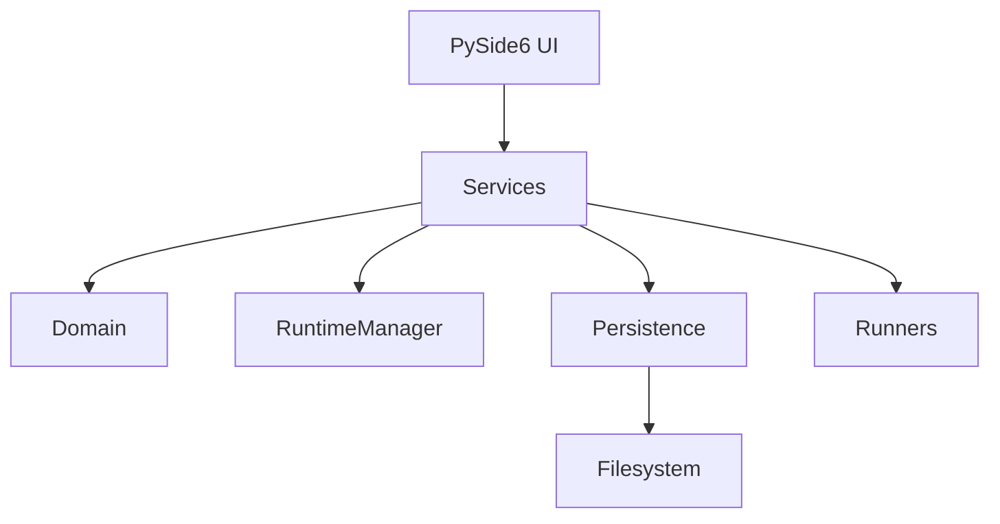

# Architecture

YOLO Trainer UI remains a Python + PySide6 desktop application. The design is
incremental: existing pages remain in place while stable boundaries are added
around workflows that future modules need to share.

- **UI** collects input, renders state, and emits intent.
- **Services** coordinate workflows and expose typed/public interfaces.
- **Domain** contains concepts such as `TrainingConfig`, `RunInfo`, and task
  state without Qt widget dependencies.
- **Core** retains reusable algorithms and established runtime behavior.
- **Persistence** owns atomic storage mechanics and cache files.
- **Runners/workers** perform asynchronous process or QThread work.

`RuntimeManager` remains the owner of runtime discovery. No page should know
managed-runtime filesystem layout. Future v0.12 Annotation Editor should add
an Annotation domain model, AnnotationService, and Annotation UI; model
inference belongs behind an asynchronous worker rather than in widgets.

Architecture principles: UI displays state and expresses intent; services
coordinate workflows; core algorithms do not import UI; persistence owns
storage; and no component is rewritten in another language merely because the
application has grown.
