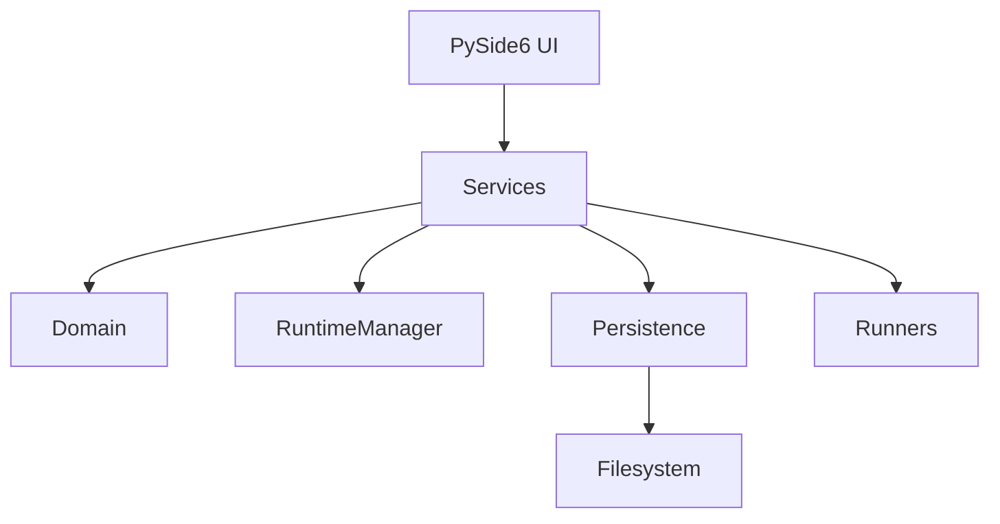
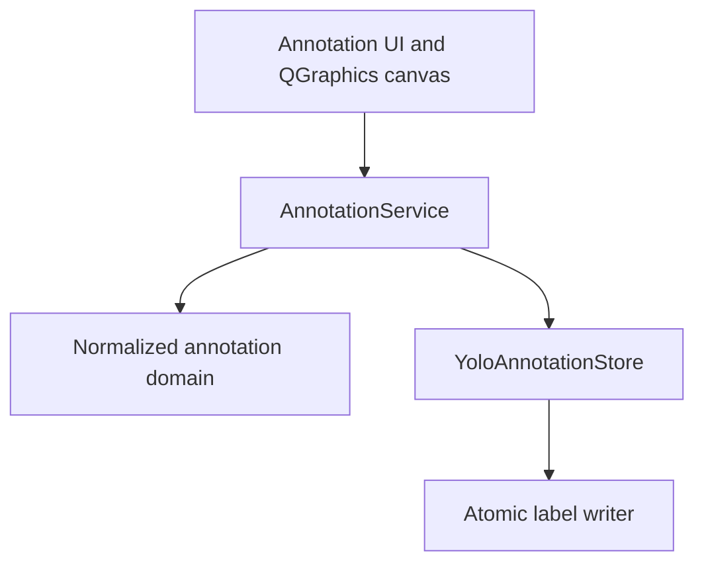
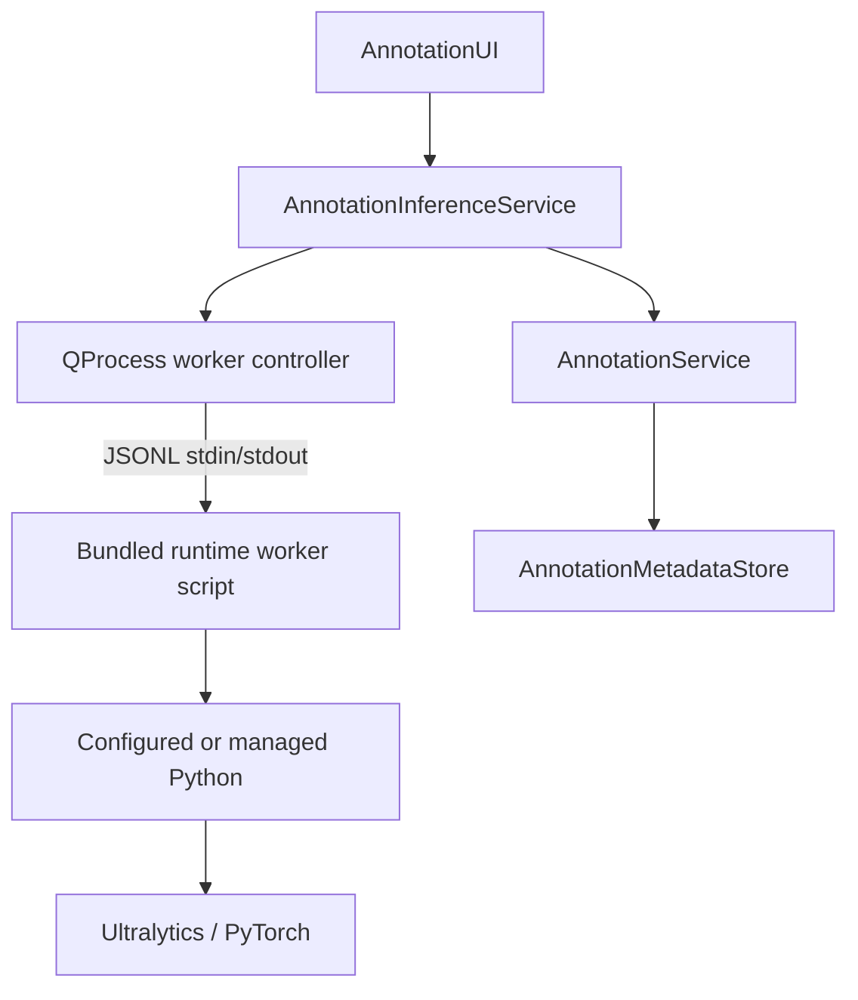

# Architecture

YOLO Trainer UI remains a Python + PySide6 desktop application. The design is
incremental: existing pages remain in place while stable boundaries are added
around workflows that future modules need to share.

- **UI** collects input, renders state, and emits intent.
- **Services** coordinate workflows and expose typed/public interfaces.
- **Domain** contains concepts such as `TrainingConfig`, `RunInfo`, and task
  state without Qt widget dependencies.
- **Core** retains reusable algorithms and established runtime behavior.
- **Persistence** owns atomic storage mechanics and cache files.
- **Runners/workers** perform asynchronous process or QThread work.

`RuntimeManager` remains the owner of runtime discovery. No page should know
managed-runtime filesystem layout.

The v0.12 annotation path follows the same boundary rules:

The canvas only reports pixel-space user intent. `AnnotationService` owns the
current-image session, mutations, dirty state, and undo/redo snapshots. Domain
conversion functions are the sole normalized/pixel geometry path, while
`YoloAnnotationStore` owns label path resolution, parsing, validation, atomic
save, and repair backups.

v0.13 adds local inference at the service boundary:

The model remains in the external worker until reload, failure, or app close.
Stdout is protocol-only and runtime logs use stderr. The GUI inference path
does not import Ultralytics or PyTorch. Validated predictions enter the existing
service mutation/undo path, while app-managed metadata stays separate from
training labels.

Architecture principles: UI displays state and expresses intent; services
coordinate workflows; core algorithms do not import UI; persistence owns
storage; and no component is rewritten in another language merely because the
application has grown.
